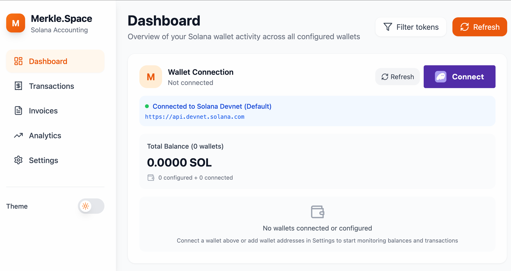

# SolBooks 🚀

**Professional Solana Accounting Software**

A beautiful, production-ready accounting application built specifically for Solana blockchain transactions. Track, classify, and manage your crypto finances with enterprise-grade features and Apple-inspired design.



## ✨ Features

### 🔗 **Wallet Integration**
- Connect multiple Solana wallets (Phantom, Solflare, Torus)
- Real-time balance tracking
- Automatic transaction detection
- Support for Devnet and Mainnet

### 📊 **Transaction Management**
- Automatic transaction import from connected wallets
- Smart transaction classification system
- Income/expense categorization
- Custom notes and tags
- Real-time balance calculations

### 🧾 **Invoice System**
- Create professional invoices
- Send payments directly through the app
- Track payment status
- Due date management
- Transaction linking

### 🎨 **Beautiful Design**
- Apple-inspired light and dark themes
- Fully responsive mobile design
- Smooth animations and micro-interactions
- Glass morphism effects
- Professional typography

### 💾 **Data Management**
- Local data storage with localStorage
- Export/import functionality
- Data backup and restore
- Multi-wallet monitoring
- Secure data handling

## 🛠️ Tech Stack

- **Frontend**: React 18 + TypeScript
- **Styling**: Tailwind CSS
- **Blockchain**: Solana Web3.js
- **Wallet**: Solana Wallet Adapter
- **Icons**: Lucide React
- **Build Tool**: Vite
- **State Management**: React Hooks

## 🚀 Quick Start

### Prerequisites
- Node.js 18+ 
- npm or yarn
- A Solana wallet (Phantom recommended)

### Installation

1. **Clone the repository**
   ```bash
   git clone https://github.com/pepeneif/SolBooks.git
   cd SolBooks
   ```

2. **Install dependencies**
   ```bash
   npm install
   ```

3. **Start development server**
   ```bash
   npm run dev
   ```

4. **Open your browser**
   ```
   http://localhost:5173
   ```

### Building for Production

```bash
npm run build
npm run preview
```

## 📱 Usage

### Getting Started
1. **Connect Your Wallet**: Click the wallet button to connect your Solana wallet
2. **View Dashboard**: See your balance, income, expenses, and recent transactions
3. **Classify Transactions**: Click "Classify" on any transaction to categorize it
4. **Create Invoices**: Use the invoice manager to create and send payment requests
5. **Export Data**: Backup your data anytime from the Settings page

### Key Features

#### **Transaction Classification**
- Automatically imports transactions from your connected wallet
- Classify transactions as income or expenses
- Add custom categories and notes
- Track unclassified transactions

#### **Invoice Management**
- Create invoices with recipient address and amount
- Set due dates and add notes
- Send payments directly through the app
- Track payment status and history

#### **Multi-Wallet Support**
- Monitor multiple wallet addresses
- Enable/disable wallet tracking
- View aggregated balances and transactions

## 🎨 Themes

SolBooks includes two beautiful themes:

- **🌞 Light Theme**: Clean, minimal design inspired by Apple's design language
- **🌙 Dark Theme**: Elegant dark mode with warm orange accents

Toggle between themes using the theme switcher in the sidebar.

## 📊 Supported Networks

- **Devnet** (Default for development)
- **Mainnet Beta** (Production)
- **Testnet** (Testing)

## 🔒 Security & Privacy

- **Local Storage**: All data is stored locally in your browser
- **No Server**: No data is sent to external servers
- **Wallet Security**: Uses official Solana wallet adapters
- **Open Source**: Full transparency with open source code

## 🤝 Contributing

We welcome contributions! Please see our [Contributing Guidelines](CONTRIBUTING.md) for details.

### Development Setup

1. Fork the repository
2. Create a feature branch: `git checkout -b feature/amazing-feature`
3. Commit your changes: `git commit -m 'Add amazing feature'`
4. Push to the branch: `git push origin feature/amazing-feature`
5. Open a Pull Request

## 📄 License

This project is licensed under the MIT License - see the [LICENSE](LICENSE) file for details.

## 🆘 Support

- **Documentation**: [Wiki](https://github.com/pepeneif/SolBooks/wiki)
- **Issues**: [GitHub Issues](https://github.com/pepeneif/SolBooks/issues)
- **Discussions**: [GitHub Discussions](https://github.com/pepeneif/SolBooks/discussions)

## 🗺️ Roadmap

- [ ] **Analytics Dashboard** - Advanced charts and insights
- [ ] **Tax Reporting** - Generate tax reports for crypto transactions
- [ ] **Multi-Chain Support** - Support for Ethereum and other blockchains
- [ ] **Mobile App** - Native iOS and Android applications
- [ ] **API Integration** - Connect with popular accounting software
- [ ] **Team Features** - Multi-user support and permissions

## 🙏 Acknowledgments

- [Solana Foundation](https://solana.org/) for the amazing blockchain platform
- [Solana Wallet Adapter](https://github.com/solana-labs/wallet-adapter) for wallet integration
- [Tailwind CSS](https://tailwindcss.com/) for the utility-first CSS framework
- [Lucide](https://lucide.dev/) for the beautiful icons

---

**Built with ❤️ for the Solana ecosystem**

[Website](https://solbooks.app) • [Twitter](https://x.com/pepeneif) • [Discord](https://discord.gg/solbooks)